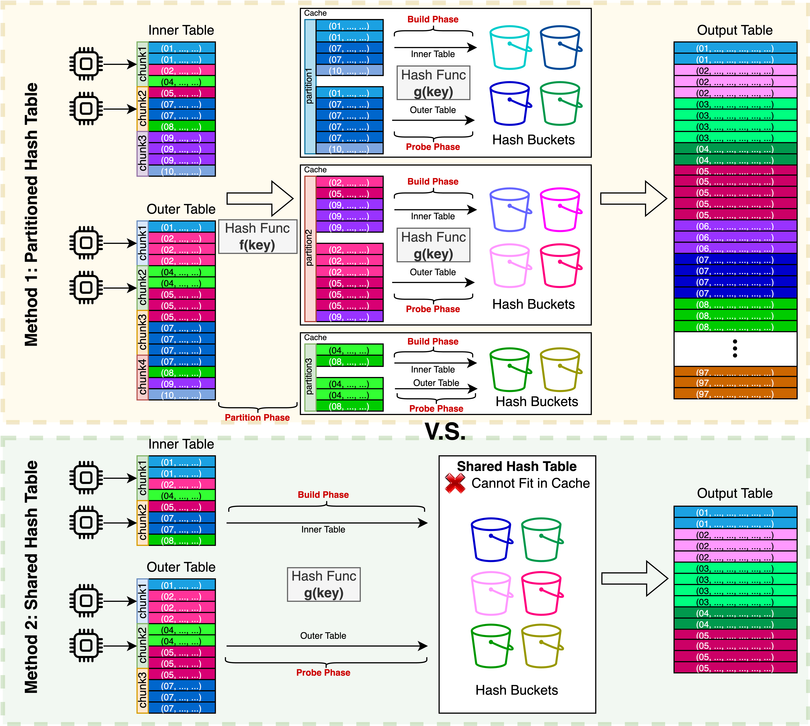

# Parallel Hash Join Optimizations in Rust

<center>Authors: Zhidong (David) Guo, Ye (Ethan) Yuan</center>

[Project Website] (https://cmu-15618-team.github.io/parallel-hash-join/)

---



## Overview

This repository contains the implementation and performance analysis of in-memory parallel hash join algorithms. The project is a deep exploration into optimizing hash join operations, a fundamental component of relational database management systems (DBMS), by leveraging parallelism and advanced memory management techniques in Rust. 

The project is part of Carnegie Mellon University's 15-618 Parallel Programming course (Spring 2024).

## Table of Contents
- [Introduction](#introduction)
- [Features](#features)
- [Methodology](#methodology)
- [Implementation Details](#implementation-details)
- [Performance Evaluation](#performance-evaluation)
- [Setup and Usage](#setup-and-usage)
- [Results](#results)
- [Contributors](#contributors)
- [License](#license)

## Introduction

Join operations are crucial for relational databases, often determining the performance of SQL queries. We focus on the hash join algorithm due to its efficiency in handling large datasets. Our project evaluates two main variants of parallel hash joins:

- **Shared Hash Join**: All threads build and use a single shared hash table.
- **Partitioned Hash Join**: Input relations are divided into partitions, and each thread operates on its local partition.

We analyze these designs using both static and dynamic task scheduling and present a comprehensive performance analysis across various workloads with different data distributions.

## Features

- **Rust Implementation**: Efficiently implemented using Rust for memory safety and performance.
- **Dynamic Scheduling**: Utilized Rayon for efficient work-stealing and load balancing.
- **Cache Utilization Analysis**: Detailed investigation into cache performance and optimization.
- **Support for Skewed and Uniform Data**: Benchmarked using datasets with different skewness levels, including uniform, low skew, and high skew distributions.

## Methodology

Our hash join algorithm is divided into three main phases:

1. **Partition Phase** (optional): Divides tables into partitions to improve cache efficiency.
2. **Build Phase**: Constructs hash tables from the inner relation.
3. **Probe Phase**: Probes the outer relation against the hash tables to generate joined tuples.

The performance of these phases was measured and analyzed under various configurations to optimize parallel execution.

### Scheduling Strategies
- **Static Scheduling**: Fixed assignment of partitions to threads.
- **Dynamic Scheduling**: Threads dynamically pick partitions, reducing workload imbalance.

### Hash Functions
We used `xxh3` as our hash function for its high performance, and `parking_lot::Mutex` for efficient synchronization in our Rust implementation.

## Implementation Details

- **Programming Language**: Rust
- **Libraries**: 
  - `Rayon` for parallel execution
  - `parking_lot` for synchronization primitives
  - `boxcar` for lock-free vector operations

### Data Structures
- **Hash Buckets**: Implemented using `Mutex<std::Vec>` for high read throughput.
- **Partition Buffers**: Implemented with `boxcar::Vec` for efficient parallel writes.

## Performance Evaluation

### Hardware
- **Platform**: Pittsburgh Supercomputing Center (PSC)
- **CPU**: AMD EPYC 7742 with 64 cores
- **Memory**: 256GB RAM

### Experiments
We benchmarked the performance using varying skew parameters to evaluate the efficiency and scalability of the implementations. The analysis covered:

- **Speedup Analysis**: Evaluated the overall and per-phase speedup.
- **Cache Analysis**: Investigated cache miss rates across configurations.
- **Synchronization Overhead**: Measured CPU cycles per output tuple for different scheduling and partitioning strategies.

## Setup and Usage

### Prerequisites
- Rust Compiler (version 1.77.2 or higher)
- Cargo for dependency management

### Installation
1. Clone the repository:
   ```bash
   git clone https://github.com/cmu-15618-team/parallel-hash-join.git
   cd parallel-hash-join
   ```
2. Build the project:
   ```bash
   cargo build --release
   ```

### Running the Benchmarks
To execute the benchmarks:
```bash
cargo run --release -- --inner-tuple-num <number> --outer-ratio <ratio> --threads <number>
```

Modify the parameters to customize the workload and evaluate performance.

## Results

- **Speedup**: Achieved up to 6.5x speedup using 8 cores in the probe phase.
- **Cache Optimization**: Partitioned hash join reduced cache misses significantly under uniform data distribution.
- **Synchronization Overhead**: Shared hash join performed better under skewed data distributions due to reduced synchronization.

For detailed performance graphs and analysis, refer to our [report](report/final-report.pdf).

## Contributors

- **Zhidong Guo** ([@zhidongg](mailto:zhidongg@andrew.cmu.edu))
- **Ye Yuan** ([@yeyuan3](mailto:yeyuan3@andrew.cmu.edu))

## License

This project is for educational purposes only as part of the 15-618 course at Carnegie Mellon University. Please do not distribute.
