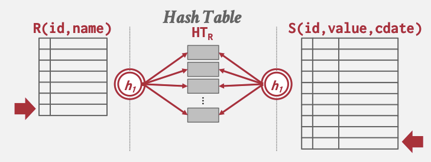

# In-Memory Parallel Hash Join: To Partition or Not To Partition

Authors: Ye Yuan, Zhidong Guo

## Sumamry

We are going to implement two variants of in-memory parallel hash join to examine the effect of CPU cache hit rate, synchronizaiton cost, and computation cost on performance.

## URL

https://github.com/cmu-15618-team/parallel-hash-join/blob/main/report/project-proposal.md

## Background

Join operation is arguably the most important operation in relational DBMS. It offers the the ability to combine two or more relations (tables) together so that the users can organize their data in multiple relations which more accurately reflects the data model in reality, eliminates duplicated data, ensures consistency, and so forth. It is also one of the most crucial operations in terms of performance because join appears in virtually every SQL query, and a bad implementation of join can be devastatingly slow. Among various join algorithms, hash join has been one of the most well-studied and widely-adopted algorithms due to its conceptual simplicity and its linear time complexity with respect to the number of pages in both relations (in a disk-oriented context).

For readers not coming from a database system world, a hash join typically works in two phase: the build phase and the probe phase. In the build phase, a hash function is applied to the join key of every tuple in the left (inner) table, mapping them into hash buckets based on the hash values. In the probe phase, the algorithm iterates through the right (outer) table, applying the same hash function to its tuples. It uses the hash value to locate the hash bucket storing tuples from the left table with the same hash value, and hence potentially the same join key. For every matching tuple from both relations, an output tuple is produced. These two staged are illustrated in the below figure.

In-memory hash join stems from the rapid evolvement of modern hardware. With machines having terabytes of memory, we no longer need to store the data on disk or spill intermediate results to disk. Instead, data is typically loaded into memory once and remains in memory for the rest of the time. Since disk I/O is no longer a bottleneck, we need to shift our focus on the performance bottleneck from disk I/O to the actual computation, i.e. the number of instructions executed and memory access pattern.

Combined with the development of multi-core CPUs, we also need to take parallelism into account. More specifically, most parallel hash join implementations divide data into disjoint partitions, and let each worker (thread, process, or phyiscial node) work on a subset of the partitions. While the ultimate goal is to do joins as fast as possible, there are two sub-directions of research to achieve this goal - minimizing cache and TLB misses and minimizing synchonization cost. In our project, we will implement two variants of hash joins. The first variant splits the data into multiple partitions which fit into the bottom-level cache, and let each worker work on disjoint partitions. The second variant lets all workers build a shared hash table, and during the probe phase each worker handles a subset of the right relation. We will compare these two variants to see which direction has better performance under different workloads.

## Challenge

The first challenge is implementing hash joins efficiently. More specifically,

- For the partitioned variant, each partition will be written to concurrently during the partition phase prior to the building phase. We cannot partition the tuples directly into the hash table, because the hash table needs to be sized based on the number of tuples in that partition, otherwise either the collision rate could be too high or it wastes a lot of memory. So we need to find an concurrent or lock-free buffer for the partition.
- For both variants, the hash table's implementation is also crucial.
  - For the shared variant, we need to have one lock per bucket. Since there can be millions of buckets, and each bucket may only contain a few tuples, using pthread mutex is prohibitively expensive in terms of memory overhead.
  - We also need a data structure that is quick to traverse. The fastest variant is surely `Vec`, but under high data skew, vector resize may invalidate cache multiple times, which defeats the purpose of partitioning.

The second challenge is designing the workload that reasonably reflects real-world workload and can simulate different data skewness.

## Resources

For now, we plan to use GHC machines to do the evaluation. In terms of software, we plan to build the system from scratch using Rust, as modifying existing systems would require too much work that is irrelevant to our topic. We will refer to [this paper](https://15721.courses.cs.cmu.edu/spring2024/papers/09-hashjoins/p37-blanas.pdf) for implementation and evaluation guidelines.

## Goals and Deliverables

### Plan to Achieve

- Implement sequential hash join as a baseline.

- Implementations of two variants of hash joins. There can be multiple implementations of the same variant, depending on what data strucutre we use.
- Performance evaluation and analysis
  - Design workloads that reflect real-world workloads and have different skewness.
  - Evaluate hash join performance by stage (partition, build, probe) using different data strucutures, compare it with performance counters, see how important a role cache plays. We will use graphs and tables to demonstrate the results.
  - Explore the effect of different partition sizes (what happens if partition size exceed cache size?) and hash table bucket sizes (affects synchronization and computation cost) on performance. We will use graphs and tables to demonstrate the results.
  - Reach a conclusion on the deciding factors of performance for in-memory hash join, if there is any.

The final program should be an efficient implementation of hash join that is supposed to be much faster than sequential implementation.

### Hope to Achieve

Time permitting, we will implement other variants of hash join, such as independent-partitioned hash join, and radix hash join.

## Choice of Platform

We choose GHC cluster because it has 16GB of memory  and 12 MB of L3 cache, which should be large enough for our testing purposes.

## Schedule

| End Date | Task                                                         |
| -------- | ------------------------------------------------------------ |
| 4-8      | Implement infrastructure such as input/output, hash table, partition buffer, and sequential hash join |
| 4-16     | Implement the first variant of hash join                     |
| 4-24     | Implement the second variant of hash join                    |
| 4-30     | Design workload and perform evaluations                      |
| 5-5      | Report writing                                               |

## References

1. https://15445.courses.cs.cmu.edu/spring2024/slides/11-joins.pdf

2. https://15721.courses.cs.cmu.edu/spring2024/papers/09-hashjoins/p37-blanas.pdf